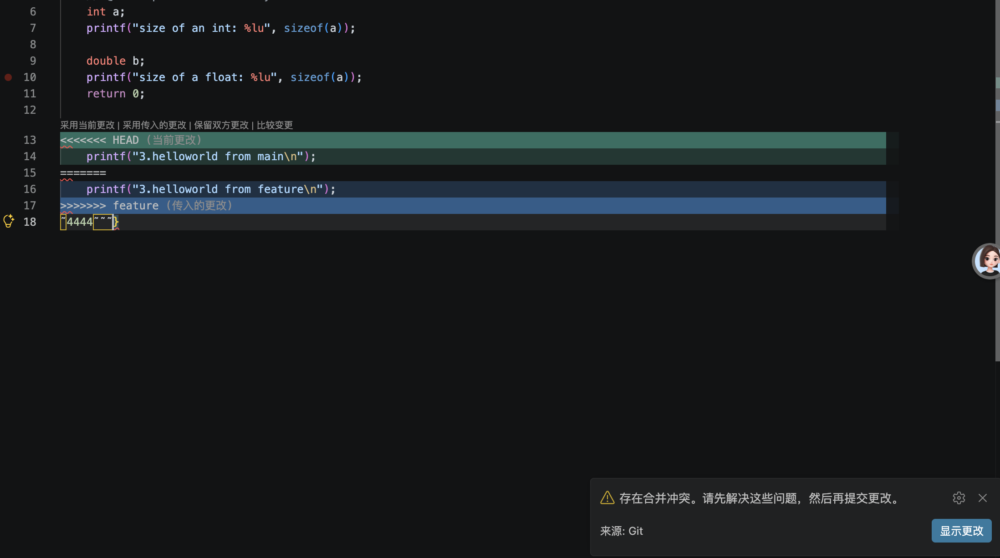

# Lab 0 : GitLab

姓名：宋翼如

学号：25300120083

## 问题回答
- 之前有在实验室多人开发的经历。我们组租了一个服务器，用remote ssh每个人开自己的主页目录，同时使用git维护版本控制
- 暂存区用来挑选要提交的改动，可以分批提交，只把部分修改打包成一次快照，避免无关代码混进同一个提交，方便代码历史清晰、排查问题。
- `git branch`：只列出本地分支 `git branch -a`（all）：列出**本地分支 + 远程跟踪分支**（远程仓库上的分支记录）
- 阅读后思考
  1. **Commit Message 规范**：该规范定义提交信息结构与类型，区分新增功能、修复 bug 等改动。规范的提交信息便于代码回溯，还能自动生成变更日志。
  2. **Git Flow 分支控制**：GitFlow 是一套分支协作模型，划分永久分支与临时分支，规定各类分支的使用场景与流转流程。它隔离开发、测试与线上代码，降低多人协作冲突。
  3. **语义化版本**：语义化版本使用`主.次.修订`三段式版本号，版本号变更含义明确。它帮助判断升级风险，常搭配 Git 标签标记项目发布版本。
  4. **为什么要学习 Git**：it 可以记录代码变更快照，个人开发时方便回退与查看修改历史。在团队开发中，借助分支策略，多人能够并行开发而不互相覆盖代码。同时 Git 支撑项目版本发布，是软件工程化交付的基础工具。 

## 使用此仓库建立个人仓库，完成 `main.c` 文件中的 `TODO` 部分并进行一次 commit。
提交了两次commit，分别是：
1. first_commit 完成了main中的TODO
2. report上传，上传了repot.md

## 实验步骤
1. 简单改动main.cpp， 编译运行，进行first_commit
2. 创建feature分支
3. 尝试第三次，出现合并冲突，手动确定了最后使用的版本，并提交fix bug。具体报错如下:  
 
通过三次尝试，发现会出现问题的情况：main分支和feature分支修改同一处问题并commit，在merge的时候会出现合并冲突。

## 我的建议
无

